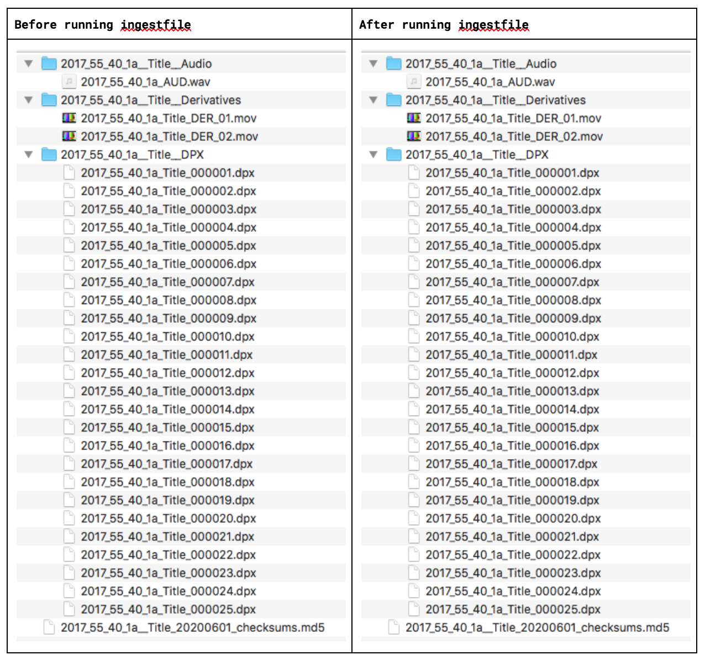
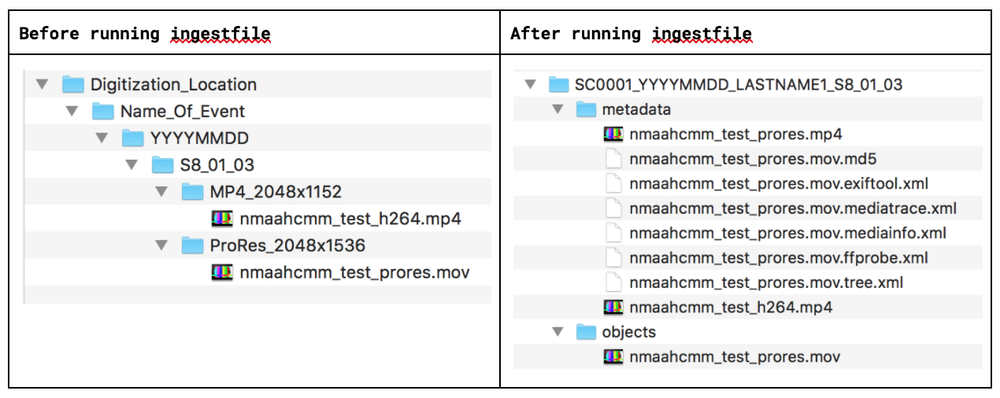
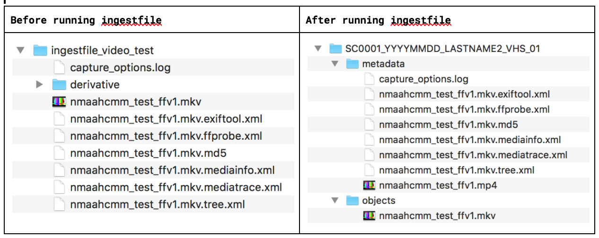
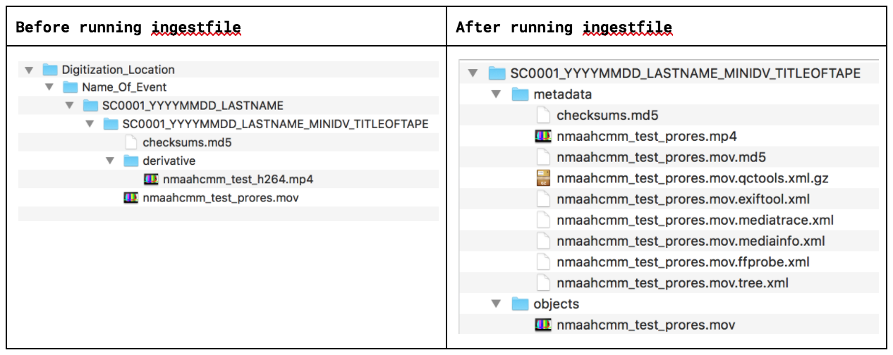
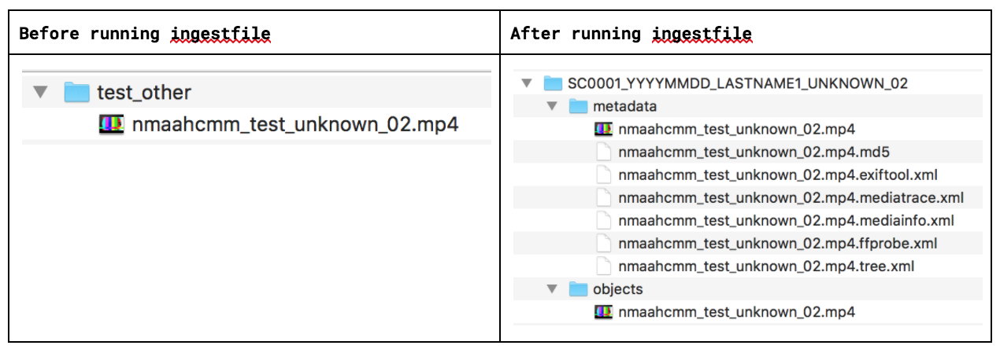
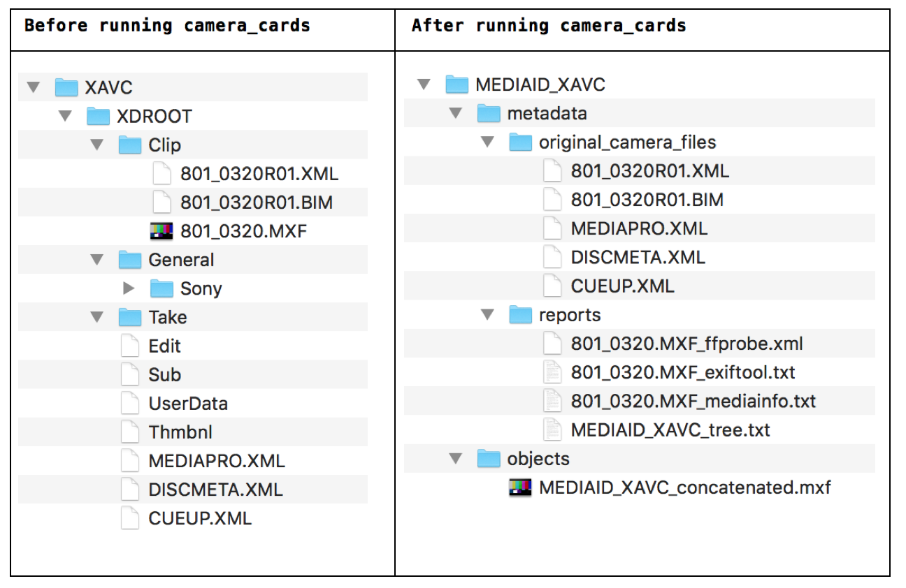
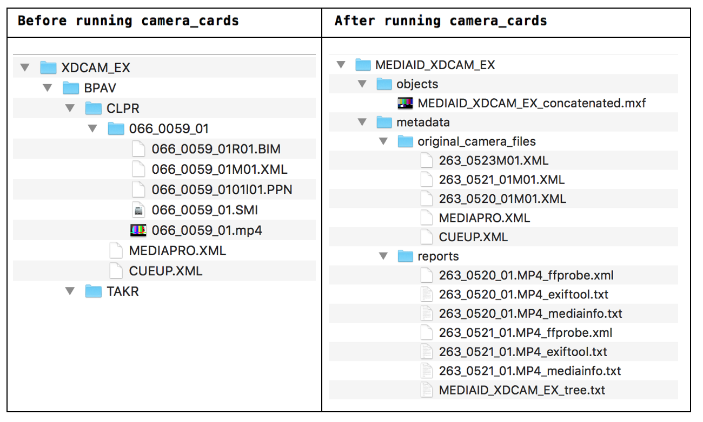
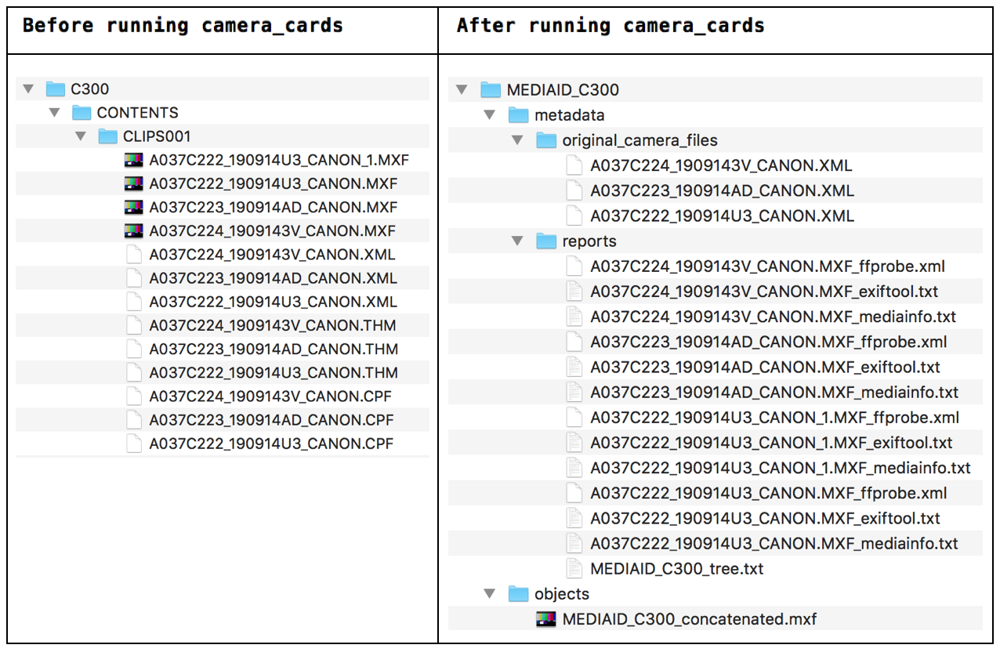
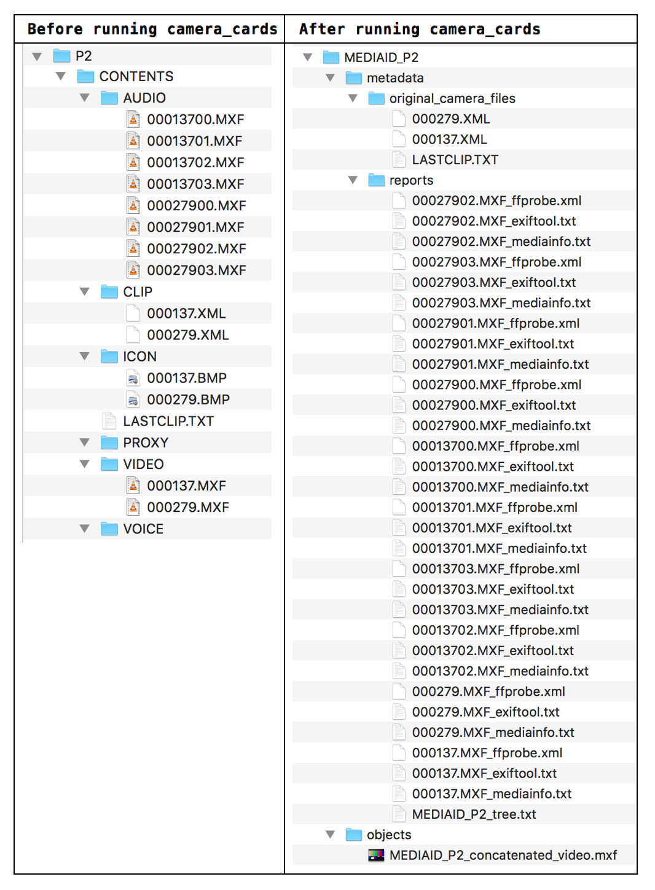
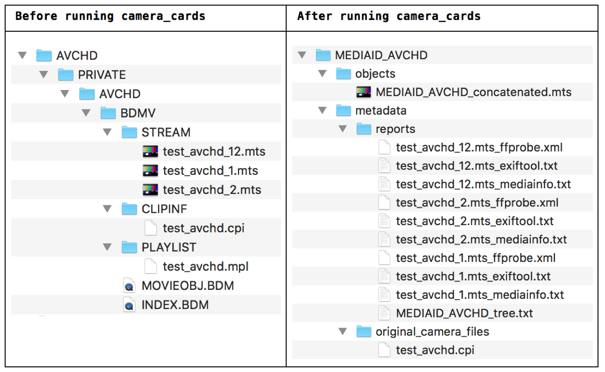

nmaahc mediamicroservices
==================

table of contents
-------------------

1. [summary](#summary)
2. [install](#install)
3. [general NMAAHC microservices and instructions for use](#nmaahcmm-functions-and-instructions-for-use)
    * [diffFrameMD5](#diffframemd5)
    * [ingestfile](#ingestfile)
    * [makechecksum](#makechecksum)
    * [makeconcat](#makeconcat)
    * [makeDer](#makeDer)
    * [makedrivetree](#makedrivetree)
    * [makeframemd5](#makeframemd5)
    * [makeH264](#makeH264)
    * [makemetadata](#makemetadata)
    * [moveDPX](#moveDPX)
    * [nmaahcmmconfig](#nmaahcmmconfig)
    * [nmaahcmmfunctions](#nmaahcmmfunctions)
    * [removeDSStore](#removeDSStore)
    * [restructureDPX](#restructureDPX)
    * [restructureForVFCU](#restructureForVFCU)
    * [restructureSIP](#restructureSIP)
    * [verifySIP](#verifySIP)
4. [Great Migration microservices and instructions for use](#great-migration-microservices-and-instructions-for-use)
    * [gmconfig](#gmconfig)
    * [makegm](#makegm)
5. [camera_cards microservice and instructions for use](#camera_cards-functions-and-instructions-for-use)
6. [log creation](#log-creation)
7. [nmaahcmm package definitions](#nmaahcmm-package-definitions)
    * [definitions](#definitions)
    * [AIP directory structure: outline](#aip-directory-structure-outline)
    * [AIP directory structures: examples](#aip-directory-structures-examples)
    * [current SIP structures](#current-sip-structures)


***

## summary

This set of mediamicroservices (mm) have been developed for the purpose of processing digital audiovisual collections at the National Museum of African American History and Culture (NMAAHC). They are based on a set of microservices developed for use at CUNY Television. These microservices borrow both concepts and code from those scripts, which are available in [the mediamicroservices GitHub repository](https://github.com/mediamicroservices/mm/).

Like CUNY TV's original mediamicroservices, these microservices are written in Bash, developed and tested for a macOS environment, and installed and run using the terminal application.

***

## install

Install [homebrew](https://brew.sh) first.

Then either

`brew install NMAAHC/nmaahcmm/nmaahcmm`

or

```
brew tap NMAAHC/nmaahcmm
brew install nmaahcmm
```

***

## nmaahcmm functions and instructions for use

For all microservices, the structure of the command looks like this:
`[microservice] -options [input]`
* the microservice is the particular command you want to execute (for example, checksumpackage)
* options are any non-default choices that the script may contain
* the input is the package, directory, or file that you are working with

Across all mediamicroservices, you can always receive the usage information by typing the microservice and -h. Your command will look like this: `[microservice] -h`.

To view the specific ffmpeg encoding options for each file, view the sourcecode of the microservice directly on GitHub or using a text editor on your computer.

#### diffFrameMD5
* This application will compare frame MD5s between two video files. It takes two text files as arguments. The text files must list the frame MD5s of the relevant video files. The results of a diff command will be displayed within the terminal.
* Your command will look like this: `diffFrameMD5 file1.txt file2.txt`
  
#### ingestfile
* This script will run an interactive interview and turn an input package (SIP) into an output package (AIP) accordingly. For more on SIPs and AIPs, see [nmaahcmm package definitions](#nmaahcmm-package-definitions).  
* Depending on the options you select and the type of package you submit, the following processes will happen:  
    * Your SIP will be restructured based on your package type (see [restructureSIP](#restructureSIP)).  
    * Metadata files will be created for preservation-level files (MOV and MKV files). If these file types aren't detected, metadata files will be created for all audio and video files in the package (see [makemetadata](#makemetadata)).  
    * An H264/MP4 derivative file will be created for all preservation-level files (MOV and MKV files). If these file types aren't detected, H264 files will be created for all audio and video files in the package (see [makeH264](#makeH264)).  
    * Your SIP will be moved to the output directory you select.  
* Your command will look like this: `ingestfile`  
* When you run the script, a menu will pop up. Fill out the fields as follows:  

    1. **Name**: Enter your name.  
    2. **Input package (SIP)**: Click “Choose” to launch the file picker, and navigate to the location where your package is stored.  
        * Select the directory that holds your preservation master file and any accompanying metadata files, not the file itself.  
        * If your SIP has a nested directory structure, select the lowest-down subdirectory that still holds all the files.
    3. **Type of package**: Select what type of package you’re ingesting; you may have to scroll to see all the options.
        * <em>Digitized Film (DPX package)</em>: Select this for all DPX packages.
            * If the script detects an outdated DPX directory structure, it will ask you if you want to run the microservice `restructureDPX`. You can select yes, no, or cancel.
            * If you select yes, the `restructureDPX` microservice will launch, with the destination directory already supplied. You will have to re-input the media ID.
            * If the script doesn’t detect an outdated DPX directory structure, it will simply move the full package to the destination directory.
        * <em>Digitized Film (MOV, MKV, MP4 master files)</em>: Select this for non-DPX digitized film packages.
            * The script will run the following microservices: `makemetadata`, `makeH264`, `restructureSIP`
        * <em>Digitized Analog Video (vrecord package)</em>: Select this for all vrecord transfers.
            * The script will run the following microservices: `makemetadata`, `makeH264`, `restructureSIP`
        * <em>Transferred DV (MOV, MKV, MP4 master files)</em>: Select this for all DV transfers not performed with vrecord.
            * The script will run the following microservices: `makemetadata`, `makeH264`, `restructureSIP`
        * <em>Other/Unknown</em>: Select this for all other package types.
            * The script will run the following microservices: `makemetadata`, `makeH264`, `restructureSIP`
    4. **Media ID/package name**: Enter the media ID. The script will only accept the letters a-z and A-Z, the numbers 0-9, hyphens -, and underscores _.
    5. **Output package (AIP) destination**: Click “Choose” to launch the file picker, and navigate to the location where you would like your AIP to be stored. Select the parent directory for all AIPs, rather than creating a new directory for this specific package. The script will create a subdirectory named after the media ID.
    6. **Running verifySIP**: Select whether to run the verifySIP microservice prior to beginning the ingestfile process proper. verifySIP compares your package against an expected package structure; it will output mismatches and unexpected items into the terminal window. The script will then pause and you will have an opportunity to cancel the ingestfile process before it continues.
    7. **Cleanup strategy**: In theory this is where you would choose to delete the original SIP once the AIP has been created; in practice all file deletion is currently hardcoded off. Leave this option as the default “Leave source files where they are.”

<em>Before (SIP) and after (AIP):</em>  
    
    
    
    
    
  
  
#### makechecksum
* This application creates md5 checksums. If you pass a single file as input, the application will create a checksum for that file and save it in a .md5 file in the same directory as your input. If you pass a directory as input, the application will create a checksum for every file in the directory and save them in .md5 files (one .md5 file for each original file) in the same directory that you supplied.
* Your command will look like this: `makechecksum fileorpackage1 fileorpackage2 [fileorpackage3 ...]`
  
#### makeconcat
* This application will concatenate multiple video files into a single video file. It takes two or more video files as arguments, all of which must be stored in the same directory. Be sure to list the video files in order. You will be asked to supply the name of the new concatenated file.
* Your command will look like this: `makeconcat file1 file2 [ file3... ]`
  
#### makeDer
* This application will create a high quality h264 file (suitable for uploading to YouTube). It takes a video file or package as input.
    * If the input is a file, the output will be named after the file's containing directory, which is assumed to be the media ID.
    * If the input is a directory, the script will create derivatives for all .mov files in the directory, and the output files will be named after those files.
* The script will send these files to a directory called "derivatives" that it creates within the input directory or containing directory. You can override this location and set the directory where the output should be sent with the -o flag. 
* Your command will look like this: `makeDer [ -o /output/directory/path/ ] fileorpackage1 [ fileorpackage2 ...]`
  
#### makedrivetree
* This application will write the contents of a drive directory in tree form and save it to a .txt file. It takes one or more drives as input.
* Your command will look like this: `makedrivetree /path/to/drive1 [ /path/to/drive2 ... ]`
  
#### makeframemd5
* This application will generate frame MD5s for all frames in a video file. It takes a video file or package as an argument. (If a package, the application will generate frame MD5s for all .mov files in the package.) The frame MD5s will be stored as text in a file with extension .framemd5.md5.
* Your command will look like this: `makeframemd5 fileorpackage`
  
#### makeH264
* This application will create a high quality h264 file (suitable for uploading to YouTube). It takes one or more video files or packages as input. You may pass both video files and packages in the same command.
    * If the input is a file, the script will create derivatives for all video files (regardless of extension) that are passed as input. Each derivative will be named after its input file. Derivatives will be created in a subdirectory called 'derivative' located within the input file's parent directory.
    * If the input is a package, the script will create derivatives for all .mov and .mkv files within the input package. Each derivative will be named after its corresponding .mov or .mkv file. Derivatives will be created in a subdirectory called 'derivative' located within the input directory.
* Your command will look like this: `makeH264 fileorpackage1 [ fileorpackage2 ...]`
  
#### makemetadata
* This application will generate metadata sidecar files for all video files in a package. It takes one or more packages as input. The application generates all of the following files: an MD5 checksum, a tree XML, a MediaInfo XML, a MediaTrace XML, an FFprobe XML, and an Exiftool XML.
* You have the option of embedding all these files except the checksum in your MKV master file. To work with these files:
    * To see what attachments are in your file and what ID #s they have, run: `mkvmerge --identify file`
        * For example: `mkvmerge --identify /path/to/file.mkv`
    * To extract those attachments, run: `mkvextract file attachments idnumber:outputfile`
        * For example, if you see that attachment 1 is a MediaInfo XML and you want to extract it into a file on the Desktop called "mediainfo.xml," run: `mkvextract /path/to/file.mkv 1:~/Desktop/mediainfo.xml`
    * To delete attachments, run: `mkvpropedit file --delete-attachment idnumber`
        * For example, to delete attachment 1: `mkvpropedit /path/to/file.mkv --delete-attachment 1`
        * Currently, the script will just continue to add attachments if it's run on the same file multiple times.
        * MKV attachments are only identified by numbers, so be sure you have extracted and looked at the content of the attachment you're trying to delete.
* This script takes a set of options. Options can be combined, and the order of the options does not matter, as long as they are in between "makemetadata" and your input. None of the options are required.
    * -m: generate an MD5 sidecar file. This file may take a while to generate, depending on the size of your video file.
        * Your command will look like this: `makemetadata -m package`
    * -q: generate a QCTools XML as well (this option is recommended for digitized video only). This file may take a while to generate, depending on the size of your video file.
        * Your command will look like this: `makemetadata -q package`
    * -o: overwrite any existing metadata files.
        * Your command will look like this: `makemetadata -o package`
    * -e: embed a copy of the metadata files generated by the script into an MKV wrapper (only for MKV files).
        * Your command will look like this: `makemetadata -e package`
* Your overall command will look like this: `makemetadata [ -e | -m | -o | -q ] package1 [ package2 ...]`
  
#### moveDPX
* This application will copy .md5 checksum files and the first .dpx file in a stack to a designated directory. It takes one or more DPX directories as arguments.
* Your command will look like this: `moveDPX dpxdirectory1 [ dpxdirectory2 ...]`
  
#### nmaahcmmconfig
  * This application will let the operator configure options for general NMAAHC microservices.
  * Once it is run, a pop-up window with the following options will appear:
      * "Please select the directory where your AIPs will be stored (see ingestfile):"
          * Use the file picker to select the destination for packages created in the `ingestfile` microservice.
      * "Please select the directory where copies of your DPX packages will go (see moveDPX):"
          * Use the file picker to select the destination for copies of DPX packages, created in the `moveDPX` microservice.
      * "Please select the directory where trees of your drives will be created (see makedrivetree)"
          * Use the file picker to select the destination for trees of your drives, created in the `makedrivetree` microservice.
      * "Please select the directory where logs for these microservices will be created:"
          * Use the file picker to select the destination for logs generated by running each microservice.
      * "Please select a directory for your temp files:"
          * Use the file picker to select the destination for temp files generated by running each microservice.
  * Your command will look like this: `nmaahcmmconfig`
  
#### nmaahcmmfunctions
* This script does not perform any actions. It functions as a central repository for functions and other code that are called by multiple scripts. Because each microservice calls those shared functions from the same location, the functions can be changed and maintained in one place instead of in multiple scripts.
* You do not need to call this script yourself.
  
#### removeDSStore
* removeDSStore is a script to remove hidden .DS\_Store files from a package input.
* Your command will look like this: `removeDSStore [input]`
  
#### restructureDPX
* This application will create the desired directory structure and filenames for DPX packages received from VFS.
* This script takes a set of options. Options can be combined, and the order of the options does not matter, as long as they are in between "restructureDPX" and your input. Some options require an argument following immediately after the option flag (e.g., -d must be followed with the path of the directory you specify: `-d [directory/path]`); these arguments are detailed below. None of the options are required to run the command; the script will interview the operator if any of the options are left out.
    * -d: specify an output directory to deliver the resulting package
        * Your command will look like this: `restructureDPX -d /path/to/deliver/to/ dpxpackage`
    * -i: specify a DPX Object ID (ex. 2012\_79\_1\_54)
        * Your command will look like this: `restructureDPX -i 2012_79_1_54 dpxpackage`
    * -t: specify a DPX Object Title (ex. Something\_to\_Build\_On)
        * Your command will look like this: `restructureDPX -t Something_to_Build_On dpxpackage`
    * -r: specify the number of reels in the package, up to 3
        * If you have 3 reels, your command will look like this: `restructureDPX -r 3 dpxpackage`
    * -c: cleanup source files (remove all source files after script runs)
        * Your command will look like this: `restructureDPX -c dpxpackage`
* Your overall command will look like this: `restructureDPX [ -d /path/to/deliver/to/ ] [ -i DPX_Object_ID ] [ -t DPX_Object_Title ] [ -r (number of reels) ] [ -c ] dpxpackage`

  
#### restructureForVFCU
* This application will restructure a DPX package directory for VFCU pickup and place .md5s in a directory. It takes one or more DPX directories as arguments.
* Your command will look like this: `restructureForVFCU DPXdirectory1 [ DPXdirectory2 ... ]`
  
#### restructureSIP
* This script will restructure a SIP into an AIP based on the type of package being submitted. The script will do the following:
    * create an output AIP directory named after an operator-selected media id and located in an operator-selected destination directory
    * create 'objects' and 'metadata' subcategories within that output AIP directory
    * rsync files from the SIP into the AIP
    * remove SIP files or leave them in place upon successful completion, depending upon operator selection
* This script takes a set of options. Options can be combined, and the order of the options does not matter, as long as they are in between "restructureDPX" and your input. Some options require an argument following immediately after the option flag (e.g., -d must be followed with the path of the directory you specify: `-d [directory/path]`); these arguments are detailed below. None of the options are required to run the command; the script will interview the operator if any of the options are left out.
    * -m: specify MEDIAID (type media id for final package, e.g. SC0001\_20190101\_SMITH\_VHS\_01)
        * Your command will look like this: `restructureSIP SC0001_20190101_SMITH_VHS_01 /path/to/SIP`
    * -o: specify an output directory to deliver the resulting package
        * Your command will look like this: `restructureSIP -o /path/to/output/directory /path/to/SIP`
    * -r: remove source files after successful ingest
        * Your command will look like this: `restructureSIP -r /path/to/SIP`
    * There is also a set of options available that specify a package type. Choose a package type (required) from one of the following options:
        * -x Package type: Digitized Film (DPX package)
        * -f Package type: Digitized Film (MKV, MOV, or MP4 files only)
        * -v Package type: Digitized Analog Video (vrecord package)
        * -d Package type: Transferred DV (MKV, MOV, or MP4 files only)
        * -u Package type: Other/Unknown -> this package type assumes an MOV or MKV file as the master video object
        * If you have a DPX package as your input, your command will look like this: `restructureSIP -x /path/to/SIP`
* Your overall command will look like this: `restructureSIP [ -x | -f | -v | -d | -u | -r ] [ -m MEDIAID ] [ -o /path/to/output/directory ] /path/to/SIP`
  
#### verifySIP
* This application will create a temporary tree of a SIP and compare it against an expected directory structure, using a series of xpath statements. It outputs mismatches and unexpected items found in AIPs into the terminal window.
    * The script applies rules based on what kind of package it thinks it's looking at. The packages are defined as follows:
        * film / analog / digitized in-house: script looks for .dpx files
        * film / analog / digitized on-location: script looks for directories named after derivatives, e.g. 'MP4_2048x1152'
        * video / analog / digitized on-location: script looks for the capture_options.log and/or qctools.xml.gz files generated in the vrecord process
        * video / DV / transferred on-location: script looks for the string 'DV' in filenames
        * If your package does not fall into one of the above categories, the script will apply a simpler baseline set of comparisons. It will assume an MOV or MKV file is the master video object.
* Your command will look like this: `verifySIP package`

***

## Great Migration microservices and instructions for use

These scripts will configure and create the directory structure for a Great Migration appointment.

#### gmconfig
* This application will let the operator configure options for a Great Migration appointment. It should be run BEFORE `makegm` (described below).
* Once it is run, a pop-up window with the following options will appear:
    * "Please navigate to and select the Great Migration directory to save to:"
        * Use the file picker to select the parent directory to save to.
    * "Please choose the formats for this Great Migration appointment:"
        * Select the checkboxes for all audiovisual formats in this appointment.
    * "Enter last name of Great Migration appointment:"
        * Enter the last name of the person at the appointment in this free-text field.
    * "Enter first name of Great Migration appointment:"
        * Enter the last name of the person at the appointment in this free-text field.
    * "Enter the name of the technician running the appointment:"
        * Enter your name in this free-text field.
    * "Create ACCESS and PRESERVATION directories for each format selected?:"
        * Answer should generally be "Yes."
* Your command will look like this: `gmconfig`

#### makegm
* This application will create standardized directories and notes for a Great Migration appointment. It will create separate directories and notes for each audiovisual format selected in gmconfig. It should be run AFTER `gmconfig` (described above).
    * The script will also name files and autofill information according to the date of the appointment (i.e., the date the script is run), the appointment holder's name, and the operator's name.
* Your command will look like this: `makegm`

Example Great Migration directory and notes files with the following parameters:  
- Operator selected "16mm" and "U-matic"  
- Script was run January 1, 2021  
- Appointment holder's name is "Firstname Lastname"  
- Operator's name is "Operator"  

```
    Great_Migration_Directory
    ├── 20210101_Lastname_Firstname_generalNotes.txt
    ├── 16mm
    │   ├── 20210101_Lastname_Firstname_16mm_Notes.txt
    │   ├── ACCESS
    │   └── PRESERVATION
    └── Umatic
        ├── 20210101_Lastname_Firstname_Umatic_Notes.txt
        ├── ACCESS
        └──  PRESERVATION
```

20210101\_Lastname\_Firstname\_generalNotes.txt:  
  
`These are general notes concerning the appointment of Firstname Lastname on 2021-01-01. They were written by the operator, Operator, and contain observations about the appointment and information relayed by Firstname Lastname.`  

20210101\_Lastname\_Firstname\_${FORMAT}\_Notes.txt:  

`These are notes concerning the [16mm films/U-matic tapes] of Firstname Lastname which were [scanned/digitized] on 2021-01-01 by the operator Operator. They cover technical and preservation concerns of the films, noted by the operator at the time of initial inspection and [scanning/digitization], not content of the films.`


***

## camera\_cards microservice and instructions for use

By default, this script will detect a born-digital camera card structure and transform the original camera card directory structure into a usable AIP. The script will:

* Concatenate video files into a single file
* Generate technical metadata files, including a tree and MediaInfo, FFprobe, and Exiftool reports
* Make a new directory structure, with an "objects" directory for audiovisual files, a "camera\_metadata" directory for significant camera-generated metadata files, and a "nmaahc\_metadata" directory for files generated by the script
* Create a log of these changes

The script can currently recognize the following camera cards:

* AVCHD (e.g. Canon C100)
* Canon XF (e.g. Canon C300)
* P2 (Panasonic)
* XAVC (Sony)
* XDCAM EX (e.g. Canon XF100)

<em>If you prefer to package files as-is to preserve your original camera directories, you can choose to compress your directory structure into a tarball. To select this option, use the '-t' flag.</em>

If your camera card structure is not recognized, the script will prompt you to choose to restructure and/or package your card as-is. If you choose to restructure your camera card, the script applies a generic profile, which identifies video and audio files using MediaInfo and sorts them into an "objects" directory; all other camera-generated files are sorted into a "camera\_metadata" directory.

This script is still a work in progress. In all cases, it is highly recommended that you review the output to make sure the script was able to process your camera files properly.

### usage

* This script takes a set of options. Options can be combined, and the order of the options does not matter, as long as they are in between `camera_cards` and your input. Some options require an argument following immediately after the option flag (e.g., -d must be followed with the path of the directory you specify: `-d [directory/path]`); these arguments are detailed below. None of the options are required to run the command; the script will interview the operator if any of the options are left out.
    * -m: specify MEDIAID (type media id for final package, e.g. `SC0001_20190101_CAMERA_OUTPUT`)
        * Your command will look like this: `camera_cards SC0001_20190101_CAMERA_OUTPUT /path/to/camera_card_directory`
    * -t: tar camera files and folders into a tarball, compressed with gzip
        * Your command will look like this: `camera_cards -t /path/to/camera_card_directory`
    * -h: display help text in the terminal
        * Your command will look like this: `camera_cards -h`
* Your overall command will look like this: `camera_cards [ -m MEDIAID ] [ -t ] /path/to/camera_card_directory`

### script logic

The script currently detects camera card structure based on directory or file name. It looks for the following directories or files in quotation marks:

* AVCHD: The "PRIVATE" directory contains all the camera card's video files.
* MXF (Canon C300): The "CLIPS001" folder directory contains all the camera card's video files.
* P2: The "LASTCLIP.TXT" file identifies the last clip recorded to the card.
* XAVC: The "XDROOT" directory is the parent directory for the P2 format.
* XDCAM EX: The "BPAV" directory is the parent directory for the XDCAM EX format.

If the camera card directory contains none of these files or subdirectories, the script applies the generic profile.

The script identifies and concatenates all audiovisual files. It preserves only significant camera-generated metadata files. "Significant" camera-generated metadata files are determined based on community members' assessments of whether these files are essential for playback, or hold important information about the audiovisual files' properties. Other standard metadata sidecar files for audiovisual content are also generated.

### camera card structures: before and after restructuring







#### generic profile

If your camera card structure is not recognized, the script will prompt you to choose to restructure and/or package your card as-is. If you choose to restructure your camera card, the script applies the following generic profile:  

```
    MEDIAID
    ├── nmaahc_metadata
    │   ├── MEDIAID_camera_card_directory.tree.txt
    │   ├── VIDEOFILE1_mediainfo.txt
    │   ├── VIDEOFILE1_exiftool.txt
    │   ├── VIDEOFILE1_ffprobe.xml
    │   ├── VIDEOFILE2_mediainfo.txt
    │   ├── VIDEOFILE2_exiftool.txt
    │   └── VIDEOFILE2_ffprobe.xml [etc.]
    ├── camera_metadata
    │   └── [all non-audiovisual files generated by camera]
    └── objects [all audiovisual files generated by camera]
        ├── VIDEOFILE1.ext
        ├── VIDEOFILE2.ext [etc.]
        ├── AUDIOFILE1.ext [etc., if present]
        └── MEDIAID.ext [concatenated video file created by script]
```

#### packaging files as-is

If you prefer to package files as-is to preserve your original camera directories, you can choose to compress your directory structure into a tarball. To select this option, use the '-t' flag. Your output will look like this: 



### sources and further resources

Thank you to the moving image archiving community members who have researched and written about born-digital camera card sturctures:

#### general resources and overviews:
* Claire Fox, "Not Normalized: Born-Digital Camera Original Video Formats in the Archives" (MIAP thesis, 2020), https://miap.hosting.nyu.edu/program/student_work/2020spring/20s_thesis_Fox_deposit_copy_y.pdf
    - An exploration of issues in documenting born-digital file-based camera original video formats for archivists.
* FADGI Audio-Visual Working Group, "Creating and Archiving Born Digital Video, Part II. Eight Federal Case Histories" (2014), http://www.digitizationguidelines.gov/guidelines/FADGI_BDV_p2_20141202.pdf
    - Case histories for archiving born-digital video (particularly referencing Crystal Sanchez, Stephanie Christensen, and Isabel Meyer's NMNH/DAMS case study)
* Kieran O'Leary, concat.py (script), https://github.com/kieranjol/IFIscripts/blob/master/concat.py
    - Python script that concatenates video files for XDCAM workflows at the Irish Film Institute
* Angelo Sacerdote, "Digital Dilemmas: Dealing with Born-Digital and Digital Surrogate Audio and Audio-Visual Collections" (SAA presentation, 2008), https://1library.net/document/qvg4m1dq-digital-dilemmas-dealing-digital-digital-surrogate-visual-collections.html
    - Introduction to born-digital audiovisual formats, including discussion of P2 camera cards
* Crystal Sanchez, Taylor McBride, and contributors, "Born-Digital Camera-Original Video: Practices and Risks" (Google spreadsheet), https://docs.google.com/spreadsheets/d/1OvZkGkizNnx_nZ9OVDOkJJIVFuIMK_7FYKC77YhoUac/edit#gid=0
    - Crowdsourced overview of born-digital camera-original formats and challenges particular to each
* Jonah Volk, "A Producer's Guide to File-Based Digital Video Preservation" (MIAP thesis, 2010), https://miap.hosting.nyu.edu/program/student_work/2010spring/JonahVolk_Thesis_20110908__y.pdf
    - An exploration of issues in preserving file-based digital video and a proposed workflow for digital video producers.

#### resources for specific camera card formats
* AVCHD (e.g. Canon C100): documentation thanks to Robert Hoffman, summer 2020 NMAAHC intern; see also Claire Fox's thesis, page 50
* Canon XF (e.g. Canon C300): documentation thanks to Robert Hoffman, summer 2020 NMAAHC intern, and Rupert Howe, http://www.premierepro.org/2016/10/canon-xf-c300-xf305-folder-structure-and-file-naming-explained/
* P2 (Panasonic): see Jonah Volk's thesis, page 6, and Angelo Sacerdote's presentation, slide 9
* XAVC (Sony): see Claire Fox's thesis, pages 50—51
* XDCAM EX (e.g. Canon XF100): see Jonah Volk's thesis, page 9, and Claire Fox's thesis, page 50


***

## log creation

Whenever a microservice is run, the following information is recorded in a text file called `nmaahcmm.log`:
* start time
* end time
* name of microservice

Microservices that ask for input from the operator, such as ingestfile, restructureSIP, and restructureDPX, also generate logs with records of that operator input. A new log file is created for each date and records input for each time the microservice is invoked that day. These logs are named after their corresponding microservice and date, e.g. `ingestfile_2020-06-28.log`.  

Logs are currently created within the same directory where the scripts are stored locally. They will be generated within a subdirectory called "logs." If you wish to change the location of the log output directory, change the path in the following line of `nmaahcmmfunctions`:  
`LOGDIR="${SCRIPTDIR}/logs/"`  

***

## nmaahcmm package definitions
  
The scripts in nmaahcmm take the principles of the Open Archival Information System as inspiration. The content in its form before ingest workflows is called the Submission Information Package (SIP). Once that content comes under archival management (i.e., once it has been normalized and restructured, and metadata has been generated), it becomes an Archival Information Package (AIP). Using automated processes with SIPs and AIPs requires that the packages be predictable; a script has to be able to expect certain files in order to categorize them and run the same processes every time.  
  
The documentation below sets expectations for the types of files that are created and submitted in accession processes for different media formats. The following scripts rely explicitly on these structures and must be updated if the definitions change:  [restructureSIP](https://github.com/NMAAHC/nmaahcmm/blob/main/restructureSIP) and [verifySIP](https://github.com/NMAAHC/nmaahcmm/blob/main/verifySIP)  
  
#### definitions
* Package (AIP) = finalized directory with structured/fleshed-out content information (in "objects" folder) and preservation description information (in "metadata" folder) for one media item (e.g. one tape or one film).  
* Package (SIP) = "as-submitted" directory containing the content information and preservation description information generated upon digitization of one or more media items.  
* Collection = parent directory containing all packages that belong to the same contributor. Collections are grouped by last name and can encompass any number of format of media item.  
* Name_Of_Event and Digitization_Location = NMAAHC digitizes both in-house and on the road. This information is included in package structures to provide context on when and where the files were created.  
  
#### AIP directory structure: outline
  
  
```
    AIP_DIRECTORY
    ├── Collection name: SC0001_YYYYMMDD_LASTNAME1  
    │   └── AIP name: SC0001_YYYYMMDD_LASTNAME1_FORMAT_ITEM#  
    │       ├── objects  
    │       │   └── videofiles.xyz  
    │       └── metadata  
    │           └── metadatafiles.xyz  
    └── Collection name: SC0001_YYYYMMDD_LASTNAME2  
        └── AIP name: SC0001_YYYYMMDD_LASTNAME2_FORMAT_ITEM#  
            ├── objects  
            │   └── videofiles.xyz  
            └── metadata  
                └── metadatafiles.xyz  
```
  
#### AIP directory structures: examples
  
  
Digitized Super 8mm film; MOV file is preservation file:  

```
    SC0001_YYYYMMDD_LASTNAME1_S8_01_03  
    ├── objects  
    │   └── SC0001_YYYYMMDD_LASTNAME1_S8_01_03.mov  
    └── metadata  
        ├── SC0001_YYYYMMDD_LASTNAME1_S8_01_03.mp4  
        ├── SC0001_YYYYMMDD_LASTNAME1_S8_01_03.md5  
        ├── SC0001_YYYYMMDD_LASTNAME1_S8_01_03.ffprobe.xml  
        ├── SC0001_YYYYMMDD_LASTNAME1_S8_01_03.mediainfo.xml  
        ├── SC0001_YYYYMMDD_LASTNAME1_S8_01_03.mediatrace.xml  
        └── SC0001_YYYYMMDD_LASTNAME1_S8_01_03.exiftool.xml  
```
  
Transferred MiniDV tape; MOV file is preservation file:  

```
    SC0001_YYYYMMDD_LASTNAME3_MiniDV_02  
    ├── objects  
    │   └── SC0001_YYYYMMDD_LASTNAME3_MiniDV_02.mov  
    └── metadata  
        ├── SC0001_YYYYMMDD_LASTNAME3_MiniDV_02.mp4  
        ├── SC0001_YYYYMMDD_LASTNAME3_MiniDV_02.md5  
        ├── SC0001_YYYYMMDD_LASTNAME3_MiniDV_02.ffprobe.xml  
        ├── SC0001_YYYYMMDD_LASTNAME3_MiniDV_02.mediainfo.xml  
        ├── SC0001_YYYYMMDD_LASTNAME3_MiniDV_02.mediatrace.xml  
        └── SC0001_YYYYMMDD_LASTNAME3_MiniDV_02.exiftool.xml  
```
  
Analog video digitized using vrecord; MKV file is preservation file:  

```
    SC0001_YYYYMMDD_LASTNAME2_VHS_01  
    ├── objects  
    │   └── SC0001_YYYYMMDD_LASTNAME2_VHS_01.mkv  
    └── metadata  
        ├── SC0001_YYYYMMDD_LASTNAME2_VHS_01.mp4  
        ├── SC0001_YYYYMMDD_LASTNAME2_VHS_01.md5  
        ├── SC0001_YYYYMMDD_LASTNAME2_VHS_01.framemd5  
        ├── SC0001_YYYYMMDD_LASTNAME2_VHS_01.ffprobe.xml  
        ├── SC0001_YYYYMMDD_LASTNAME2_VHS_01.mediainfo.xml  
        ├── SC0001_YYYYMMDD_LASTNAME2_VHS_01.mediatrace.xml  
        ├── SC0001_YYYYMMDD_LASTNAME2_VHS_01.exiftool.xml  
        ├── SC0001_YYYYMMDD_LASTNAME2_VHS_01.mkv.qctools.xml.gz  
        ├── SC0001_YYYYMMDD_LASTNAME2_VHS_01_QC_output_graphs.jpeg  
        ├── SC0001_YYYYMMDD_LASTNAME2_VHS_01_capture_options.log  
        └── SC0001_YYYYMMDD_LASTNAME2_VHS_01_ffmpeg_decklink_input.log  
```
  
#### current SIP structures
  
  
*FILM / analog / digitized in-house*  
  
```
    2017_55_40_1a__Title  
    ├── 2017_55_40_1a__Title_YYYYMMDD_checksums.md5  
    ├── 2017_55_40_1a__Title__Audio  
    │   └── 2017_55_40_1a_AUD.wav  
    ├── 2017_55_40_1a__Title__DPX  
    │   └── [DPX files]  
    ├── 2017_55_40_1a__Title__Derivatives  
    │   ├── 2017_55_40_1a_DER_01.mov  
    │   └── 2017_55_40_1a_DER_02.mov  
    └── checksums-md5.txt  
```
  
Naming:  
Collection directory:       n/a  
Package name:               2017_55_40_1a\__Title  
Preservation master filename: [DPX files]  
Derivative subdirectory:    2017_55_40_1a\__Title\__Derivatives  
Derivative filename:     2017_55_40_1a_DER_01.mov  
  
  
*FILM / analog / digitized on-location*  
  
```
    Digitization_Location  
    └── Name_Of_Event  
        └── YYYYMMDD  
            └── SC0001_YYYYMMDD_LASTNAME  
                ├── S8_01_03  
                │   ├── MP4_2048x1152  
                │   │   └── SC0001_YYYYMMDD_LASTNAME1_S8_01_03.mp4  
                │   └── ProRes_2048x1536  
                │       └── SC0001_YYYYMMDD_LASTNAME1_S8_01_03.mov  
                └── SC0001_YYYYMMDD_LASTNAME.cdir  
```
  
Naming:  
Collection directory:       SC0001_YYYYMMDD_LASTNAME  
Package name:               S8_01_03  
Preservation master filename: SC0001_YYYYMMDD_LASTNAME1_S8_01_03.mov  
Derivative subdirectory:    MP4_2048x1152  
Derivative filename:        SC0001_YYYYMMDD_LASTNAME1_S8_01_03.mp4  
  
  
*VIDEO / analog / digitized on-location*  
  
```
    Digitization_Location  
    └── Name_Of_Event  
        └── YYYYMMDD  
            ├── SC0001_YYYYMMDD_LASTNAME2_VHS_01  
            │   ├── SC0001_YYYYMMDD_LASTNAME2_VHS_01.framemd5  
            │   ├── SC0001_YYYYMMDD_LASTNAME2_VHS_01.mkv  
            │   ├── SC0001_YYYYMMDD_LASTNAME2_VHS_01.mkv.qctools.xml.gz  
            │   ├── SC0001_YYYYMMDD_LASTNAME2_VHS_01.mp4  
            │   ├── SC0001_YYYYMMDD_LASTNAME2_VHS_01_QC_output_graphs.jpeg  
            │   ├── SC0001_YYYYMMDD_LASTNAME2_VHS_01_capture_options.log  
            │   └── SC0001_YYYYMMDD_LASTNAME2_VHS_01_ffmpeg_decklink_input.log  
            └── SC0001_YYYYMMDD_LASTNAME2_VHS_05  
                ├── SC0001_YYYYMMDD_LASTNAME2_VHS_05.framemd5  
                ├── SC0001_YYYYMMDD_LASTNAME2_VHS_05.mkv  
                ├── SC0001_YYYYMMDD_LASTNAME2_VHS_05.mkv.qctools.xml.gz  
                ├── SC0001_YYYYMMDD_LASTNAME2_VHS_05.mp4  
                ├── SC0001_YYYYMMDD_LASTNAME2_VHS_05_QC_output_graphs.jpeg  
                ├── SC0001_YYYYMMDD_LASTNAME2_VHS_05_capture_options.log  
                └── SC0001_YYYYMMDD_LASTNAME2_VHS_05_ffmpeg_decklink_input.log  
```
  
Naming:  
Collection directory:       n/a  
Package name:               SC0001_YYYYMMDD_LASTNAME2_VHS_01  
Preservation master filename:          SC0001_YYYYMMDD_LASTNAME2_VHS_01.mkv  
Derivative subdirectory:    n/a  
Derivative filename:        SC0001_YYYYMMDD_LASTNAME2_VHS_01.mp4  
  
  
*VIDEO / DV / transferred on-location*  
  
```
    Digitization_Location  
    └── Name_Of_Event  
        └── SC0001_YYYYMMDD_LASTNAME3  
            ├── SC0001_YYYYMMDD_LASTNAME3_MiniDV_02_TITLEOFTAPE  
            │   ├── SC0001_YYYYMMDD_LASTNAME3_MiniDV_02_TITLEOFTAPE.mov  
            │   ├── SC0001_YYYYMMDD_LASTNAME3_MiniDV_02_TITLEOFTAPE_YYYYMMDD_checksums.md5  
            │   └── derivative  
            │       └── SC0001_YYYYMMDD_LASTNAME3_MiniDV_02_TITLEOFTAPE.mp4  
            └── SC0001_YYYYMMDD_LASTNAME_MiniDV_04_TITLEOFTAPE  
                ├── SC0001_YYYYMMDD_LASTNAME_MiniDV_04_TITLEOFTAPE.mov  
                ├── SC0001_YYYYMMDD_LASTNAME_MiniDV_04_TITLEOFTAPE_YYYYMMDD_checksums.md5  
                └── derivative  
                    └── SC0001_YYYYMMDD_LASTNAME_MiniDV_04_TITLEOFTAPE.mp4  
```
  
Naming:  
Collection directory:       SC0001_YYYYMMDD_LASTNAME  
Package name:               SC0001_YYYYMMDD_LASTNAME3_MiniDV_02_TITLEOFTAPE  
Preservation master filename:            SC0001_YYYYMMDD_LASTNAME3_MiniDV_02_TITLEOFTAPE.mov  
Derivative subdirectory:    derivative  
Derivative filename:        SC0001_YYYYMMDD_LASTNAME3_MiniDV_02_TITLEOFTAPE.mp4  
